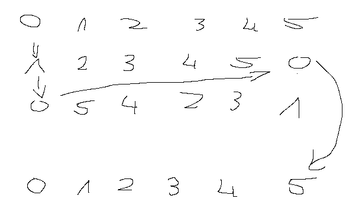

Kazdy wirnik ma w srodku slownik jaka indeks na jaki indeks sie zamienia(jaka litera na jaka litere)
mamy 3 wirniki.

zakladamy ze kazdy wirnik ma na wejsciu od a - z czyli 0 - 25 w srodku kazdego rotora dana cyfra jest przypisana jakiejs innej np. 0-1 1-5 2-8
w taki sposob przechodzimy przez kazday zz 3 rotorow potem mamy reflection ktory jest staly i i lecimy od od rotora 3 do 1 znowu i wypluwa wynik 

rotory przesuwaja sie np. rotor 1 ma przesuniecie przy kazdym kliknieciu

!!! wazne przesuniecie rotora wykonuje sie przed wgl zakodowaniem literki wiec jesli moj rotor 1 ma offset 0 przy kliknieciu rotor obraca sie na offset +1
i doperio wtedy dochodzi do kodowania litery

obroty dzialaja następująco: kazdy w wirnikow ma swoj 'notch' np dla wirnika 1 moze byc to q wtedy przy przejsciu z q na r wirnika 1 przesuwa sie takze  wirnik 2
tak samo to dzial adla reszyty wirnikow wirnik 2 ma swojch notch na 'e' gdy wirnik 2 przechodzi z e na f wirnik 3 przechodzi o jedna pozycje. Wirnik na pozycji 3 nie ma wplywu na obrót nie ma kogo za soba popchnac

sposobem na obliczenie pozycji wirnikow wzgledem siebie mozna zrobic nastepujaca:
Rotor lewy(pierwszy)
wejscie = (sygnal + offset_lewy) % 26
przejsci: wew = tablica_lewy[wejscie]
wyjscie: sygnal = (wew - offset_lewy) % 26

przyklad mapowanie [1, 0, 5, 4, 2, 3]:
klikam 0 i chce je zakodowac:
rotor lewy przesuiwa sie mamy offset +1
klikajac 0 trafiam w pin nr 1 pin nr 1 przekierowuje nas na pin 0
przesuniecie powoduje ze nasz pin 0 jest na pozycji 5 wiec do koljengo rotora wyjdzie sygnal 5

WIZUALIZACJA:

dalej powtrzama to 3 raz

dochodzimy do reflektora ktory jest staly i zawsze daje nam dana zamiane np 1->5 i teraz idziemy w druga strone.
teraz nasze piny wchodza od drugiej strony wiec musimy stworzyc odwortna mape dla kazdego z tyhc wirnkow.

wiec jesli w wirniku 1 0 -> 1
to teraz 1 -> 0 
jesli 4 -> 2
to teraz 2 -> 4

mozna to osiagnac albo poprzez storzenie ppest odrotnej mapy dla kazdego wirnika albo przez patrzenie pod jakim indeksem lezy nasza dana liczba

znowu przechoidzmy 3 razy i mamy nasza zakodowana cyfre

Pytania:
ile rotorow uzyc 
czy moje rotory maja byc identyczne jak bylo irl

